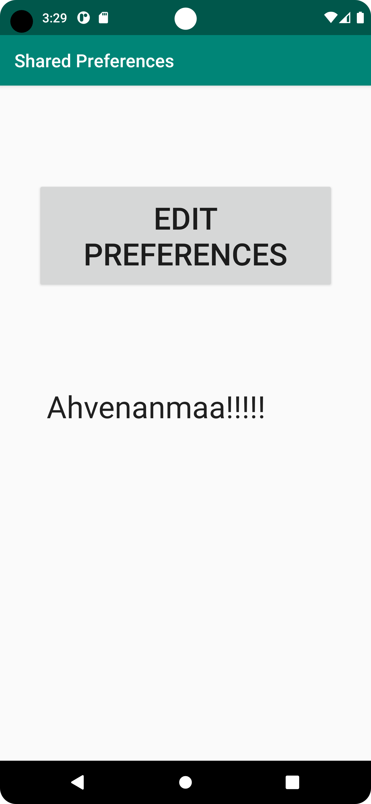
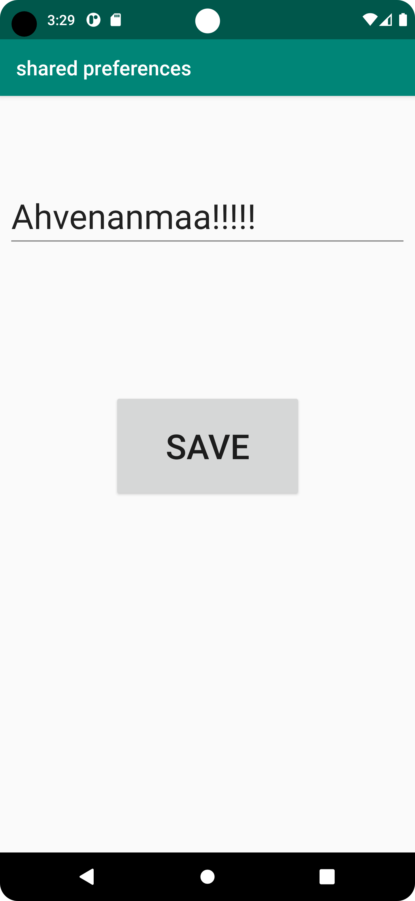

1. skapade layouts
main activity:
```
<?xml version="1.0" encoding="utf-8"?>
<androidx.constraintlayout.widget.ConstraintLayout xmlns:android="http://schemas.android.com/apk/res/android"
    xmlns:app="http://schemas.android.com/apk/res-auto"
    xmlns:tools="http://schemas.android.com/tools"
    android:layout_width="match_parent"
    android:layout_height="match_parent"
    tools:context=".MainActivity">

    <com.google.android.material.appbar.AppBarLayout
        android:id="@+id/appBarLayout"
        android:layout_width="match_parent"
        android:layout_height="wrap_content"
        android:theme="@style/AppTheme.AppBarOverlay"
        app:layout_constraintEnd_toEndOf="parent"
        app:layout_constraintStart_toStartOf="parent"
        app:layout_constraintTop_toTopOf="parent">

        <androidx.appcompat.widget.Toolbar
            android:id="@+id/toolbar"
            android:layout_width="match_parent"
            android:layout_height="?attr/actionBarSize"
            android:background="?attr/colorPrimary"
            app:popupTheme="@style/AppTheme.PopupOverlay" />

    </com.google.android.material.appbar.AppBarLayout>

    <TextView
        android:id="@+id/preferenceText"
        android:layout_width="308dp"
        android:layout_height="83dp"
        android:text="sad"
        android:textAppearance="@style/TextAppearance.AppCompat.Large"
        android:textSize="34sp"
        app:layout_constraintBottom_toBottomOf="parent"
        app:layout_constraintEnd_toEndOf="parent"
        app:layout_constraintStart_toStartOf="parent"
        app:layout_constraintTop_toBottomOf="@+id/appBarLayout" />

    <Button
        android:id="@+id/button"
        android:layout_width="330dp"
        android:layout_height="120dp"
        android:text="edit preferences"
        android:textSize="34sp"
        app:layout_constraintBottom_toTopOf="@+id/preferenceText"
        app:layout_constraintEnd_toEndOf="parent"
        app:layout_constraintStart_toStartOf="parent"
        app:layout_constraintTop_toBottomOf="@+id/appBarLayout" />

</androidx.constraintlayout.widget.ConstraintLayout>

```

second activity:
```
<?xml version="1.0" encoding="utf-8"?>
<androidx.constraintlayout.widget.ConstraintLayout xmlns:android="http://schemas.android.com/apk/res/android"
    xmlns:app="http://schemas.android.com/apk/res-auto"
    xmlns:tools="http://schemas.android.com/tools"
    android:layout_width="match_parent"
    android:layout_height="match_parent">

    <com.google.android.material.appbar.AppBarLayout
        android:id="@+id/appBarLayout"
        android:layout_width="match_parent"
        android:layout_height="wrap_content"
        android:theme="@style/AppTheme.AppBarOverlay"
        app:layout_constraintEnd_toEndOf="parent"
        app:layout_constraintStart_toStartOf="parent"
        app:layout_constraintTop_toTopOf="parent">

        <androidx.appcompat.widget.Toolbar
            android:id="@+id/toolbar"
            android:layout_width="match_parent"
            android:layout_height="?attr/actionBarSize"
            android:background="?attr/colorPrimary"
            app:popupTheme="@style/AppTheme.PopupOverlay" />

    </com.google.android.material.appbar.AppBarLayout>


    <EditText
        android:id="@+id/editTextText"
        android:layout_width="wrap_content"
        android:layout_height="wrap_content"
        android:ems="10"
        android:inputType="text"
        android:text=""
        android:textSize="34sp"
        app:layout_constraintBottom_toTopOf="@+id/button2"
        app:layout_constraintEnd_toEndOf="parent"
        app:layout_constraintStart_toStartOf="parent"
        app:layout_constraintTop_toTopOf="parent" />

    <Button
        android:id="@+id/button2"
        android:layout_width="187dp"
        android:layout_height="105dp"
        android:text="save"
        android:textSize="34sp"
        app:layout_constraintBottom_toBottomOf="parent"
        app:layout_constraintEnd_toEndOf="parent"
        app:layout_constraintStart_toStartOf="parent"
        app:layout_constraintTop_toTopOf="parent" />
</androidx.constraintlayout.widget.ConstraintLayout>
```

2. gjorde så att mainactivity kan läsa prefrences
```
package com.example.project;

import android.content.Intent;
import android.content.SharedPreferences;
import android.os.Bundle;
import android.util.Log;
import android.view.View;
import android.widget.Button;
import android.widget.EditText;
import android.widget.TextView;

import androidx.appcompat.app.AppCompatActivity;
import androidx.appcompat.widget.Toolbar;

public class MainActivity extends AppCompatActivity {

    // in My MainActivity class
    private SharedPreferences myPreferenceRef;
    private SharedPreferences.Editor myPreferenceEditor;


    @Override
    protected void onCreate(Bundle savedInstanceState) {
        super.onCreate(savedInstanceState);
        setContentView(R.layout.activity_main);
        Toolbar toolbar = findViewById(R.id.toolbar);
        setSupportActionBar(toolbar);
        // In onCreate()
        myPreferenceRef = getSharedPreferences("preferences", MODE_PRIVATE);
        myPreferenceEditor = myPreferenceRef.edit();

        Button button = findViewById(R.id.button);

        final TextView editText = findViewById(R.id.preferenceText);
        editText.setText(myPreferenceRef.getString("MyPersistentData", "No data found."));


        // set onClickListener for button
        button.setOnClickListener(new View.OnClickListener() {

            @Override
            public void onClick(View view) {
                Log.d("iamlogginglikehell", "iamlogginglikehell");
                Intent intent = new Intent(MainActivity.this, secondactivity.class);
                // start second activity
                startActivity(intent);
            }
        });
    }

    @Override
    protected void onResume() {
        super.onResume();
        TextView preferenceView = findViewById(R.id.preferenceText);
        preferenceView.setText(myPreferenceRef.getString("MyPersistentData", "No preference found."));
        myPreferenceEditor.apply();
    }
}
```

3. skapade second activity sam gjorde att den kan läsa och skriva in prefrences
```
package com.example.project;

import android.content.SharedPreferences;
import android.os.Bundle;
import android.util.Log;
import android.widget.Button;
import android.widget.EditText;
import android.widget.TextView;

import androidx.appcompat.app.AppCompatActivity;
import androidx.appcompat.widget.Toolbar;

public class secondactivity extends AppCompatActivity {


    private SharedPreferences myPreferenceRef;
    private SharedPreferences.Editor myPreferenceEditor;
    public void onCreate(Bundle savedInstanceState) {
        Log.d("BBB", "BBB");
        super.onCreate(savedInstanceState);
        setContentView(R.layout.activity_second);
        Toolbar toolbar = findViewById(R.id.toolbar);
        setSupportActionBar(toolbar);

        myPreferenceRef = getSharedPreferences("preferences", MODE_PRIVATE);
        myPreferenceEditor = myPreferenceRef.edit();

        final EditText editText = findViewById(R.id.editTextText);
        editText.setText(myPreferenceRef.getString("MyPersistentData", "No data found."));
        Button button = findViewById(R.id.button2);

        button.setOnClickListener(new android.view.View.OnClickListener() {
            @Override
            public void onClick(android.view.View view) {
                myPreferenceEditor.putString("MyPersistentData", editText.getText().toString());
                myPreferenceEditor.apply();
                finish();
            }
        });
    }
}
```

bilder:



